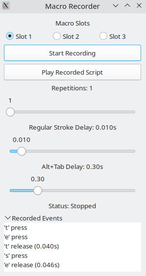

# Macro Recorder

## Overview

The Macro Recorder is a Python-based application that allows users to record and replay keyboard actions. It features a GTK graphical user interface (GUI) to manage and store multiple macro slots. Macros can be saved, loaded, and executed, making it a useful tool for automating repetitive keyboard tasks.



## Features

- **Record Keyboard Actions**: Capture key presses and releases in real time.
- **Multiple Macro Slots**: Store up to three separate macros for easy management.
- **Play Back Macros**: Replay recorded macros with customizable delays.
- **Settings Management**: Adjust settings for repetitions and delay times for alt-tab actions.

## Requirements

- Python 3.x
- `pynput` library for keyboard event handling
- Tkinter (included with Python standard library for GUI)
- `libgirepository-2.0-dev` - install it with `sudo apt install libgirepository-2.0-dev`
- `libcairo2-dev` - install it with `sudo apt install libcairo2-dev` 

## Installation

Install from PyPI:

```console
pip install linux_macrorecorder
```

Or clone the repository for local development:

```console
git clone https://github.com/werzum/MacroRecorder.git
cd MacroRecorder
```

## Usage

Launch the application with:

```console
python -m macrorecorder
```

This command starts the GTK GUI. Use the buttons in the interface to start recording a macro or play back a stored macro. Select the desired macro slot (1, 2, or 3) before recording or playing back to manage different macros effectively.

The tool is aimed at a keyboard-oriented workflow (hence supporting no mouse input). A typical workflow is:

1. Start the Macro Recorder GUI.
2. Alt+Tab from the GUI to the tool you want to automate (such as a spreadsheet) and back.
3. After confirming Alt+Tab switches between the GUI and your target app, return to the Macro Recorder GUI.
4. Click "Start Recording", Alt+Tab to your target app, and perform the actions you want recorded.
5. Alt+Tab back to the Macro Recorder GUI and stop recording.
6. Adjust the playback settings and play the recording.

Recorded macros and settings are stored in `recorded_keys.json` in the project root.
